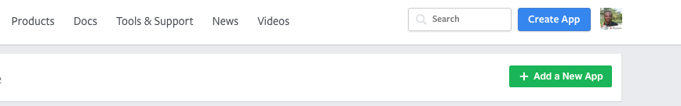
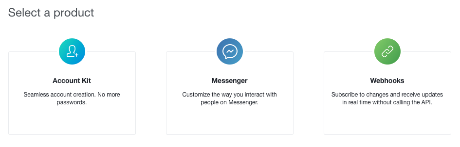
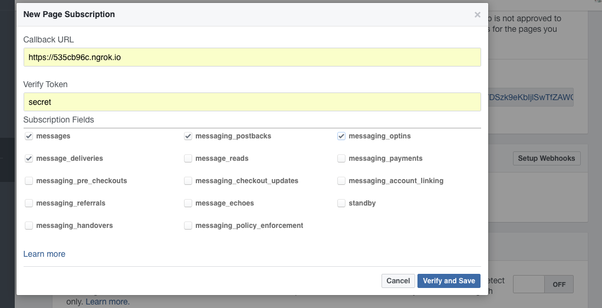
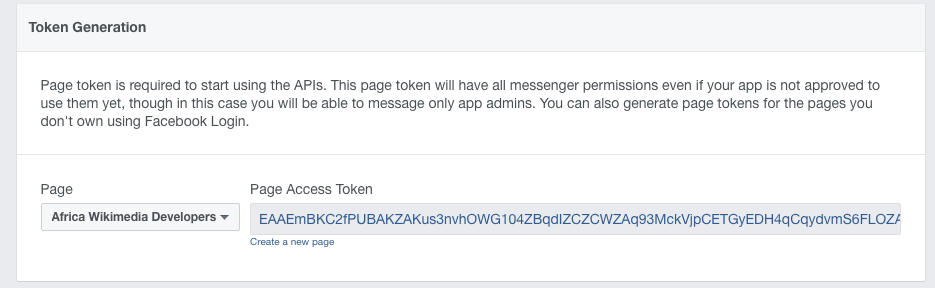

## Facebook Messenger Chat Bot for Starters


#### Install Dependencies

Install `Flask` & `requests` packages using Python's dependency package manager(`pip`);

```shell 
pip install Flask requests
```

Download and Install ngrok from the [Official Ngrok Website](https://ngrok.com/).


#### Run Server & Tunnel Connection

Run the dev server using: 

```shell 
python server.py
```

Use `ngrok` to tunnel the connection; 

```shell 
./ngrok http 5000
```

You will see the url for your local server. Something like: `https://6cecffb8.ngrok.io`. 


#### Setup Facebook App & Access Token;

* Create a Facebook App from [Facebook Developer Website](https://developers.facebook.com/).


* Set Up the `Messenger` Product (you should have a Facebook Page link your bot with).



* Select a page and enable webhooks. Use the above URL as the callback webhook URL (it should be `https`).


* Edit `server.py` and update the `VERIFY_TOKEN`(you set, in this case "secret") & `ACCESS_TOKEN`(randomly generated token).


* Once the callback is verified, subscribe the app to one of your pages to activate the bot.


* Also generate a page access token for that page.



* Edit `server.py` and update the `ACCESS_TOKEN` with the new token we got.


### Testing the bot

Visit your Facebook Page to chat with the bot. Make sure to follow all the steps above in order for the bot to 
be activated on your Facebook Page. :+1: